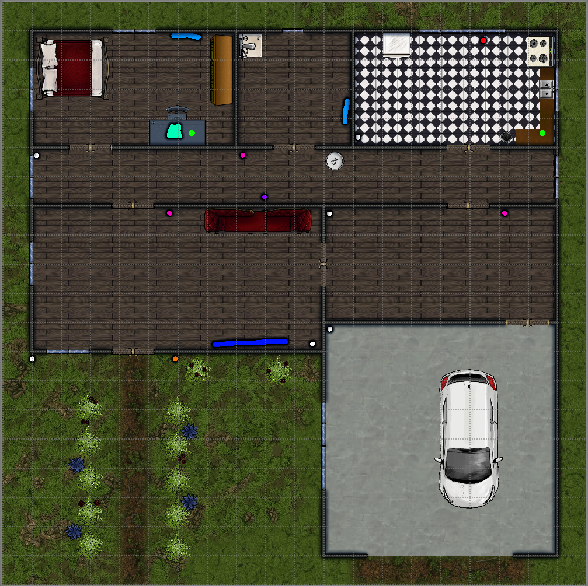

# Caso de estudo

## Table of contents

- [Caso de estudo](#caso-de-estudo)
  - [Table of contents](#table-of-contents)
  - [História](#história)
  - [Aplicações](#aplicações)
  - [Contextos](#contextos)
  - [Objetos](#objetos)
  - [Desenho da casa](#desenho-da-casa)

## História

Angelo é um homem comum de uma realidade futurista, que toda manhã, depois de 
uma noite bem dormida na sua **cama inteligente**, acorda com seu 
**relógio inteligente** as 5:50 da manhã. Ele vai para o banheiro, lava o 
rosto na pia e escova os dentes lendo algumas manchetes no 
**espelho inteligente**. Após ter terminado, ele checa a saúde de seus dentes 
na análise que a **escova inteligente** fez, e toma um banho no seu 
**chuveiro inteligente**. Enquanto isso, sua **cafeteira inteligente** já 
prepara seu café para comer com um pão fresquinho que sua máquina de fazer 
pão começou a fazer na noite passada.

Quando chega na cozinha, as **cortinas inteligentes** e **janelas inteligentes** se abrem para aproveitar a luz do dia. Nesse momento, o termostato analisa o ambiente e ajusta a temperatura para ficar mais confortável, ligando o **ar-condicionado inteligente**

Mas hoje ele está com vontade de comer ovos mexidos também. Então, ele vai no 
seu **armário inteligente** e pega os ingredientes. Nesse momento, o armário
identifica que alguns itens estão acabando e oferece a opção de pedir
automaticamente os itens, mas Angelo recusa pois estava precisando ir no
centro da cidade de qualquer forma e não estava a fim de pagar frete. Angelo 
vai até sua **geladeira inteligente** e pega os ovos, a **embalagem inteligente** mostra que estão bons para o consumo.

Com os ingredientes em mãos, Angelo pede para sua **alexa** ligar seu 
**fogão inteligente** para aquecer sua **panela inteligente** na temperatura 
perfeita. Ele faz os ovos mexidos e já coloca os itens na sua 
**lava-louças inteligente**. Enquanto come, pede para a **alexa** ativar o
**robô aspirador de pó inteligente** e pergunta onde está jake, seu gatinho.
Com dispositivos conectados, a **coleira inteligente** e o **piso inteligente** cruzam informações e revelam que ele está na lavanderia. Angelo, muito astuto, pede para a alexa ativar o **comedouro inteligente**, que logo libera a comida (Angelo não deixou isso automático pois gosta de comer com jake), logo a localização de jake muda rapidamente e ele chega em questão de segundos ao ouvir o som da ração caindo no potinho.

Depois de ter comido, ele vai no seu **guarda-roupa inteligente** e pede ajuda
para decidir o que vestir hoje de acordo com o clima. Logo o guarda-roupa
mostra uma bermuda e uma **camisa inteligente** (hoje está fazendo muito calor), ele veste seu **anél inteligente** e **colar inteligente**, pega seu 
**not-ablet** (notbook+tablet) e se dirige para a garagem para ir ao trabalho 
com seu **carro inteligente**. Antes de entrar no carro, ele repara que o 
sistema de irrigação de seu quintal está estranho e logo pergunta para a alexa
o que aconteceu. Ela responde que, em um ponto da **mangueira inteligente** 
a pressão da água está menor que o padrão, logo o **gotejador inteligente**
desligou o fluxo de água para evitar desperdício. "Marque isso na minha lista
de tarefas por favor", disse Angelo.

No momento que o carro sai de casa, as **portas inteligentes** e 
**janelas inteligentes** se fecham e trancam, **lampadas inteligentes** apagam
telas como **televisão inteligente**, se estavam ligados, desligam.

## Aplicações
1.  Detecção de quedas
2.  Controle de microprocessadores através de voz, aplicação mobile ou 
    aplicação web 
3.  Cuidados com animais de estimação (batimentos cardiacos, alimentação
    na hora correta, mensagens de emergêcia, camera)
4.  Gerenciamento de gasto de energia (monitoramento e redução de consumo)
5.  Gerenciamento de gasto de agua (monitoramento e redução de consumo)
6.  Sistema de segurança e privacidade inteligente (alarmes, autolock)
7.  Sistema de localização interno (Fingerprint based)
8.  Sistema detector de gases perigosos
9.  Sistemas de cuidado com a saúde (batimentos cardiacos)
10. Sistemas de controle de luz 
11. Controladores de temperatura e umidade
12. Aplicações com RFID (abrir portão, liberar ração)
13. Serviço de limpeza inteligente (robo aspirador, 
    fechar janelas se muito vento)
14. Jardim inteligente (regar as plantas quando necessário)
15. Locomoção inteligente (carro inteligente andando)
16. Cocção inteligente (fogão inteligente)
17. Gerenciamento de inventário 

## Contextos
1. Tamanho de tela [1080x720]
2. Pixels de camera [13MP]
3. aberto/fechado
4. Conectividade wifi [802.11b/g/n (2,4 GHz e 5 GHz)]
5. Hardware de Som 
6. Processador 
7. Conectividade Bluetooth
8. Peso do objeto [45kg]
9. Disponibilidade de idioma [pt-br, en-us]
10. Idioma atual
11. Hardware de microfone
12. Alimentação de energia [USB-C, bateria 24mAh Lipo]
13. Cor [azul]
14. Temperatura de iluminação
15. Tipo de tela [touch]
16. Capacidade total [15 itens, litros]
17. Programa em Execução [secagem]
18. Programas [Automático, Frio, Seco, Ventilador]
19. Luz interna [ligado/desligado]
20. Peso da prateleira [14kg]
21. Quantidade de itens internos[12]
22. Garantia [10 anos]
23. Ventilando [sim]
24. Velocidade de ventilação [5/4]
25. Capacidade de Resfriamento(min/max) [1.61 ~ 6.45 kW]
26. Capacidade de Aquicimento(min/max) [1.17 ~ 6.30 kW]
27. Nível de ruído [43dBA] 
28. Classificação energética [A]
29. Consumo energético (potência) [1630W]
30. Corrente de operação (Resfriamento) [7.7A]
31. Corrente de operação (Aquecimento) [7.5A]
32. Tipo de compressor [BLDC]
33. Remoção de Umidade (l/h): [2.0 l/hr]
34. Circulação de Ar (Resfriamento): [17.9 m3/min]
35. Gás Refrigerante: [R410A]
36. Carga de Gás Refrigerante (kg): [1.11 kg ]
37. Posição da aba: [cima]
38. Filtro [antialérgico removível]
39. Voltagem [120V]
40. Área de cobertura [42m²]
41. Comprimento [20cm]
42. Largura [4mm]
43. Profundidade [42m]
44. Espessura [15mm]
45. Porcentagem da Bateria [45%]
46. Tipos de sensores existentes [temperatura, acelerômetro, frequencia cardiaca]
47. Compatibilidade (SO) [iOS, Android]
48. Material [Prata]
49. Tempo de carregamento da bateria
50. Grau de proteção IP
51. Condições de temperatura de armazenamento
52. Condições de umidade de armazenamento
53. Marca
54. Nome
55. Ligado/desligado
56. Detecção de presença [true/false]
57. umidade interna
58. pH interno
59. presença microbiana interna
60. Valvula de vapor [aberta/fechada]
61. Temperatura interna Refrigerador: 1º a 7º
62. Temperatura interna Freezer:-15ºC a -23ºC.
63. Capacidade Refrigerador [270 L]
64. Capacidade Freezer [100 L]
65. Temperatura interna Forno

TODO: pegar os contextos dos objetos

## Objetos
1.  Alexa (caixa de som)
    Aplicações [2, 5, 12, 13, 15, 16, 17, 19, 20, 21] 
    Contextos 
2.  Armário inteligente 
    Aplicações [20] 
    Contextos 
3.  Ar-condicionado Inteligente 
    Aplicações [3, 4, 6, 13] 
    Contextos 
4.  Anel inteligente 
    Aplicações [1, 5, 9, 11, 14] 
    Contextos 
5.  Cafeteira inteligente 
    Aplicações [19] 
    Contextos 
6.  Cama inteligente
    Aplicações [11]
    Contextos 
7.  Camisa inteligente 
    Aplicações [11] 
    Contextos 
8.  Camera inteligente
    Aplicações [1, 3, 5, 8, 9, 20]
    Contextos 
9.  Chuveiro inteligente 
    Aplicações [7]
    Contextos 
10. Computador inteligente 
    Aplicações [6, 15]
    Contextos 
11. Carro inteligente 
    Aplicações [18]
    Contextos 
12. Colar inteligente 
    Aplicações [1, 9, 11, 14] 
    Contextos 
13. Coleira inteligente
    Aplicações [3, 9, 14]
    Contextos 
14. Comedouro inteligente
    Aplicações [3]
    Contextos 
15. Cortinas inteligentes
    Aplicações [12]
    Contextos 
16. Embalagem inteligente 
    Aplicações [11, 19]
    Contextos 
17. Escova inteligente 
    Aplicações [11]
    Contextos 
18. Espelho inteligente
    Aplicações [15]
    Contextos 
19. Fogão inteligente
    Aplicações [19, 6]
    Contextos 
20. Geladeira inteligente
    Aplicações [20, 6]
    Contextos 
21. Gotejador inteligente
    Aplicações [7, 17]
    Contextos 
22. Guarda-roupa inteligente 
    Aplicações [15] 
    Contextos 
23. Janelas inteligentes 
    Aplicações [12]
    Contextos 
24. Lampadas inteligentes 
    Aplicações [6, 12]
    Contextos 
25. Lava-louças inteligente
    Aplicações [16]
    Contextos 
26. Panela inteligente 
    Aplicações [19]
    Contextos 
27. Piso inteligente 
    Aplicações [1, 9]
    Contextos 
28. Portas inteligentes 
    Aplicações [8, 14]
    Contextos 
29. Relógio inteligente 
    Aplicações [1, 11, 15]
    Contextos 
30. Robô aspirador de pó inteligente 
    Aplicações [9, 16]
    Contextos []
31. Sensor de umidade do solo 
    Aplicações [17]
    Contextos []
32. Medidores de PH da agua
    Aplicações [17]
    Contextos []
33. Sensor de monóxido de carbono
    Aplicações [17]
    Contextos []
34. Sensor de nitrogênio do solo
    Aplicações [17]
    Contextos []
35. Sensor de fósforo do solo
    Aplicações [17]
    Contextos []
36. Sensor de potássio do solo
    Aplicações [17]
    Contextos []
37. Sensor de Ph do solo
    Aplicações [17]
    Contextos []
38. Sensor de dióxido de carbono do solo
    Aplicações [17]
    Contextos []
39. Sensor de salinidade do solo
    Aplicações [17]
    Contextos []
40. Sensor de fumaça
    Aplicações [5, 10]
    Contextos []
41. Sensor de precipitação
    Aplicações [7, 17]
    Contextos []
42. Televisão inteligente 
    Aplicações [15]
    Contextos []

## Desenho da casa

Legenda de cores: (posição [x;y])

humano com: Anel inteligente, colar inteligente, relógio inteligente [anda aleatóriamente]

Verde agua: Computador [sempre na posição 6;16]

azul claro: espelho inteligente

azul escuro: televisão

verde: echo Dot (alexa)

branco: cameras

roxo: coleira inteligente (gato)

sofá [9; 13]

cama [3; 18]

Guarda roupa [8; 18]

armário da cozinha

armario do banheiro

fogão [19; 19]

carro [6; 17]

televisão

janelas inteligentes + cortinas inteligentes

Comedouro inteligente [18;16]

Robo aspirador de pó inteligente [anda pela casa, sempre volta pra 2;14]

chuveiro inteligente [9 ;19]

piso inteligente [cada quadrado no interiror da casa]

Geladeira inteligente [14; 19]

Embalagens inteligentes [espalhados dentro da geladeira inteligente e armários inteligentes]

Escova inteligente [no armário do banheiro]

laranja: gotejador inteligente

lampada inteligente: [todo comodo terá uma no centro dele]

panela inteligente: [uma no fogão e algumas no armário da cozinha]

sensor de fumaça: [todo comodo terá uma no centro dele]

sensores de [33 a 41] em cada uma das plantas do lado de fora da casa

Sensor de precipitação [junto com o gotejador inteligente]

Vermelho: máquina de lavar louça inteligente
